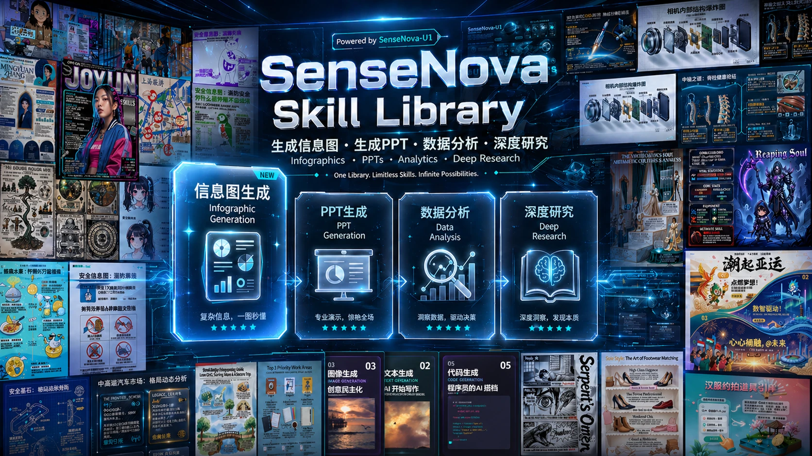

# SenseNova Image & Visualization Skills

English | [简体中文](README_CN.md)



This branch is intentionally focused: it contains only five complete image and visualization skills. It is designed for any Agent Skills-compatible host and uses `sensenova-u1.5-lite` as the default model for image generation and editing. Model use follows the account's current plan and credit rules.

## Included skills

| Skill | Capability |
|---|---|
| [`sn-image-base`](skills/sn-image-base/SKILL.md) | U1.5 text-to-image, native multi-reference editing, explicit optional text/vision adapters, and controlled U1 Fast fallback |
| [`sn-image-doctor`](skills/sn-image-doctor/SKILL.md) | Offline installation, dependency, key, endpoint, model, sizing, and watermark diagnostics |
| [`sn-infographic`](skills/sn-infographic/SKILL.md) | 87 layouts, 66 styles, prompt expansion, 1-15 user-bounded rounds, visual review, evidence-based editing/regeneration, and result ranking |
| [`sn-image-imitate`](skills/sn-image-imitate/SKILL.md) | Reference analysis, content rewrite, U1.5 native imitation, consistency review, and ranked retries |
| [`sn-image-resume`](skills/sn-image-resume/SKILL.md) | Fact-preserving visual resumes with fixed layout rules and edit-based correction |

The full bilingual infographic gallery remains available in [English](docs/sn-infographic-examples.md) and [Chinese](docs/sn-infographic-examples_CN.md).

## Defaults

- Primary: `sensenova-u1.5-lite`
- Generation-only fallback: `sensenova-u1-fast`
- Watermark: off
- U1.5 prompt extension: on
- U1.5 response: Base64 saved immediately to disk
- Text/vision model: none; the host Agent plans and reviews by default

U1 Fast is used automatically only for recoverable text-to-image failures (404, 429, or retry-exhausted 5xx). It is never used for image editing, authentication/authorization failures, bad parameters, safety blocks, or local file problems.

The repository deliberately sends `watermark=false`. SenseNova currently offers watermark removal free during public beta and documents it as a premium paid feature after the beta; review account charges before production use when that policy changes.

See the official [SenseNova API documentation](https://platform.sensenova.cn/docs) and find the `SenseNova U1.5 Lite` or `SenseNova U1 Fast` section by its heading. The documentation site's deep links are not reliable on a cold load.

## Quick start

```bash
python -m venv .venv
# Windows: .venv\Scripts\activate
# macOS/Linux: source .venv/bin/activate
python -m pip install -r skills/sn-image-base/requirements.txt
```

Copy `.env.example` to an ignored `.env` and set only your key for the default setup:

```dotenv
SENSENOVA_API_KEY=your-key
```

One shared key is sufficient. If a capability uses a different credential, set its optional `SN_IMAGE_GEN_API_KEY`, `SN_CHAT_API_KEY`, `SN_TEXT_API_KEY`, or `SN_VISION_API_KEY`. Image resolution is CLI argument > `SN_IMAGE_GEN_API_KEY` > `SENSENOVA_API_KEY`; text and vision resolution is CLI argument > their capability-specific key > `SN_CHAT_API_KEY` > `SENSENOVA_API_KEY`. See [Installation](INSTALL.md#configure) for details.

Run diagnostics:

```bash
python skills/sn-image-doctor/scripts/check_environment.py --verbose
```

Generate:

```bash
python skills/sn-image-base/scripts/sn_agent_runner.py sn-image-generate \
  --prompt "A clean bilingual infographic about renewable energy" \
  --image-size 2k \
  --aspect-ratio 16:9 \
  --save-path output.png \
  --output-format json
```

Edit or continue editing:

```bash
python skills/sn-image-base/scripts/sn_agent_runner.py sn-image-edit \
  --prompt "Keep the layout and correct the title" \
  --images output.png \
  --save-path corrected.png \
  --output-format json
```

For installation into an Agent Skills host, see [INSTALL.md](INSTALL.md). API and CLI details are in [the image guide](docs/sn-image-generate_en.md).

## Security

Never commit API keys. Use an ignored `.env`, your Agent's secret store, or temporary non-echo environment injection. JSON and diagnostics mask secrets and never intentionally print request authorization headers.

## License

See [LICENSE](LICENSE).
